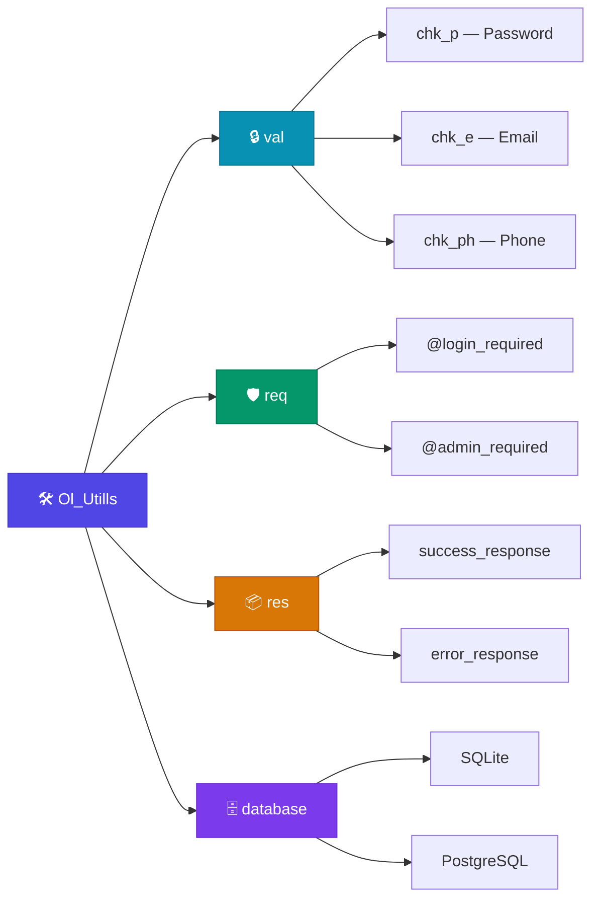
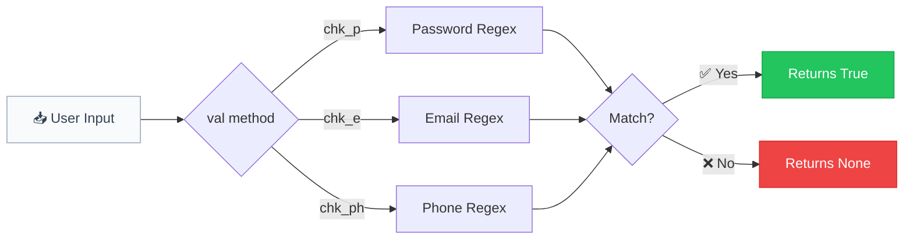
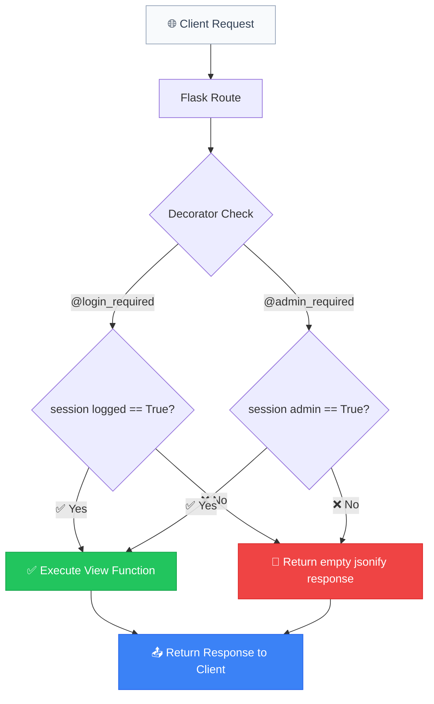
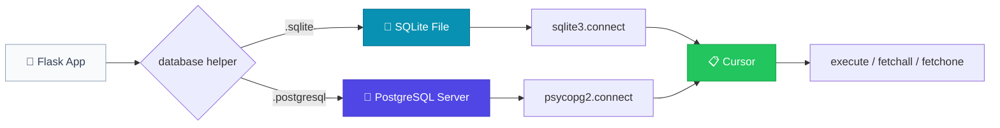
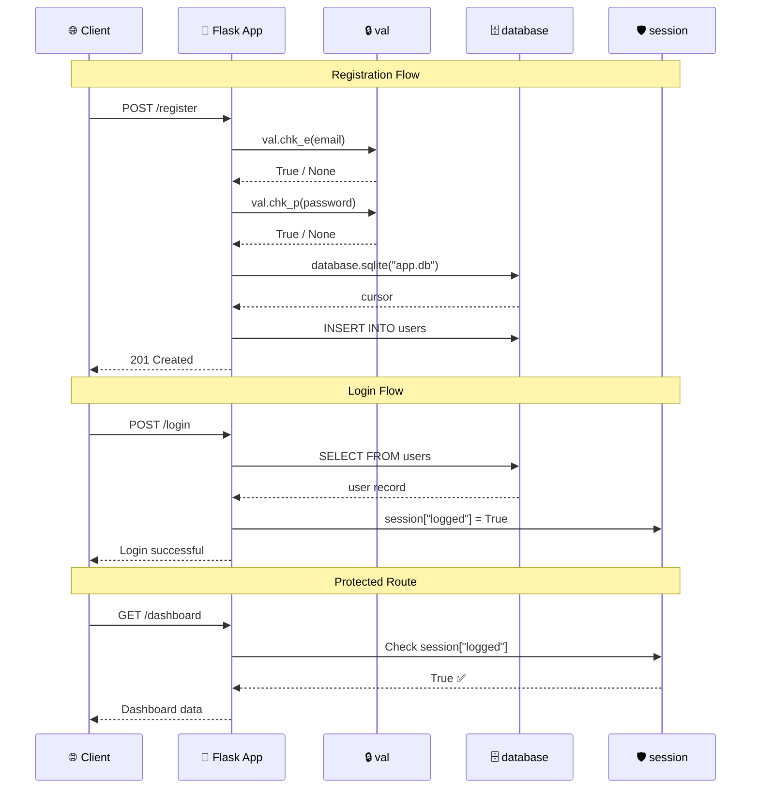

<p align="center">
  
  <h1 align="center">🛠️ Ol_Utills</h1>
  <p align="center">
    A lightweight Flask utility library for validation, authentication, and database helpers.
  </p>
</p>

<p align="center">
  <a href="https://pypi.org/project/ol-utills/">
    
  </a>
  <a href="https://pypi.org/project/ol-utills/">
    
  </a>
  <a href="https://github.com/OverLimit-OL/Ol_Utills/blob/main/LICENSE">
    
  </a>
</p>

---

## ✨ Features

- **Input Validation** — Password, email, and phone number validation using battle-tested regex patterns.
- **Auth Decorators** — Drop-in `@login_required` and `@admin_required` decorators for Flask routes.
- **Database Helpers** — Quick-connect utilities for **SQLite** and **PostgreSQL**.
- **Zero Config** — Works out of the box with any Flask app.

### 🏗️ Architecture Overview



---

## 📦 Installation

```bash
pip install ol-utills
```

### Requirements

| Dependency | Purpose |
|---|---|
| `flask` | Session management & JSON responses |
| `psycopg2` | PostgreSQL connectivity |

> **Note:** `sqlite3` and `re` are part of the Python standard library and do not need to be installed.

### Supported Python Versions

- Python **3.8** and above

---

## 🚀 Quick Start

```python
from Ol_Utills import val, req, database

# Validate an email
if val.chk_e("user@example.com"):
    print("Valid email!")

# Connect to a SQLite database
db = database.sqlite("app.db")
db.execute("SELECT * FROM users")
```

---

## 📖 Detailed Documentation

### Table of Contents

1. [val — Validation](#val--validation)
2. [req — Authentication Decorators](#req--authentication-decorators)
3. [res — Response Helpers](#res--response-helpers)
4. [database — Database Connections](#database--database-connections)
5. [Full Flask App Example](#-full-flask-app-example)

---

### `val` — Validation

The `val` class provides static methods for validating common user inputs using regular expressions. All methods return `True` on success and `None` on failure, making them easy to use in conditional checks.



---

#### `val.chk_p(password)`

Validates password strength against a robust regex pattern.

| | Details |
|---|---|
| **Parameter** | `password` *(str)* — The password string to validate |
| **Returns** | `True` if valid, `None` if invalid |

**Password Rules:**

The password must satisfy **all** of the following criteria:
- ✅ Minimum **7 characters** long (6 + 1 trailing non-whitespace)
- ✅ At least **1 uppercase** letter (`A-Z`)
- ✅ At least **1 lowercase** letter (`a-z`)
- ✅ At least **1 digit** (`0-9`)
- ✅ Must **not** contain whitespace
- ✅ The last character must be a **non-whitespace** character

> **Note:** Special characters (e.g. `@`, `#`, `!`) are allowed but not required.

**Examples:**

```python
from Ol_Utills import val

# ✅ Valid passwords
val.chk_p("MyP@ss1234")    # True — uppercase, lowercase, digit, special char
val.chk_p("Hello1x")        # True — meets all minimum criteria
val.chk_p("Abcdef1")        # True — exactly 7 chars, has upper, lower, digit

# ❌ Invalid passwords
val.chk_p("weak")            # None — too short, no uppercase, no digit
val.chk_p("alllowercase1")  # None — no uppercase letter
val.chk_p("ALLUPPERCASE1")  # None — no lowercase letter
val.chk_p("NoDigits!")       # None — no digit
val.chk_p("Ab1")             # None — too short
```

**Usage in a Flask route:**

```python
from flask import Flask, request, jsonify
from Ol_Utills import val

app = Flask(__name__)

@app.route('/register', methods=['POST'])
def register():
    password = request.form.get('password')
    
    if not val.chk_p(password):
        return jsonify({
            "error": "Password must be 7+ chars with at least 1 uppercase, 1 lowercase, and 1 digit."
        }), 400
    
    # Proceed with registration...
    return jsonify({"message": "Registration successful"}), 201
```

---

#### `val.chk_e(email)`

Validates an email address against the **RFC 2822** specification using a comprehensive regex pattern.

| | Details |
|---|---|
| **Parameter** | `email` *(str)* — The email address string to validate |
| **Returns** | `True` if valid, `None` if invalid |

**Validation Covers:**

- ✅ Standard emails: `user@example.com`
- ✅ Subdomains: `user@mail.example.com`
- ✅ Plus addressing: `user+tag@example.com`
- ✅ Dots in local part: `first.last@example.com`
- ✅ Quoted strings: `"unusual@chars"@example.com`
- ❌ Missing `@` symbol
- ❌ Missing domain
- ❌ Spaces in unquoted local parts
- ❌ Control characters

**Examples:**

```python
from Ol_Utills import val

# ✅ Valid emails
val.chk_e("user@example.com")          # True
val.chk_e("first.last@company.co.uk")  # True
val.chk_e("user+filter@gmail.com")     # True
val.chk_e("admin@192.168.1.1")         # True

# ❌ Invalid emails
val.chk_e("not-an-email")              # None — no @ symbol
val.chk_e("@missing-local.com")        # None — no local part
val.chk_e("spaces in@email.com")       # None — spaces not allowed
val.chk_e("")                           # None — empty string
```

---

#### `val.chk_ph(phone)`

Validates international phone numbers.

| | Details |
|---|---|
| **Parameter** | `phone` *(str)* — The phone number string to validate |
| **Returns** | `True` if valid, `None` if invalid |

**Supported Formats:**
- ✅ International: `+1-555-555-5555`
- ✅ With parentheses: `(555) 555-5555`
- ✅ With dots: `555.555.5555`
- ✅ With spaces: `+44 20 7946 0958`
- ✅ Plain digits: `5555555555`

**Examples:**

```python
from Ol_Utills import val

val.chk_ph("+1-800-555-0199")    # True
val.chk_ph("(555) 123-4567")     # True
val.chk_ph("+44 20 7946 0958")   # True
```

---

### `req` — Authentication Decorators

The `req` class provides Flask route decorators for session-based authentication. These decorators wrap your view functions and check the Flask `session` object before allowing access.

**How It Works:**



---

#### `@req.login_required`

Restricts a Flask route to authenticated (logged-in) users only.

| | Details |
|---|---|
| **Session Key** | `session['logged']` |
| **Required Value** | `True` (boolean) |
| **On Success** | Executes the decorated view function normally |
| **On Failure** | Returns an empty JSON response via `jsonify()` |

**Prerequisites:**

You must set `session['logged'] = True` somewhere in your login logic (e.g., after verifying credentials).

**Example:**

```python
from flask import Flask, session, request, jsonify
from Ol_Utills import req

app = Flask(__name__)
app.secret_key = 'your-secret-key'

# Login route — sets session
@app.route('/login', methods=['POST'])
def login():
    username = request.form.get('username')
    password = request.form.get('password')
    
    # ... verify credentials against database ...
    
    session['logged'] = True         # ← Required for @login_required
    session['username'] = username   # ← Optional: store user info
    return jsonify({"message": "Logged in successfully"})

# Protected route — requires login
@app.route('/dashboard')
@req.login_required
def dashboard():
    return jsonify({"message": "Welcome to your dashboard"})

# Logout route — clears session
@app.route('/logout')
def logout():
    session.pop('logged', None)
    return jsonify({"message": "Logged out"})
```

**Behavior:**

| Scenario | `session['logged']` | Result |
|---|---|---|
| User is logged in | `True` | View function runs normally |
| User is not logged in | Missing or `False` | Returns empty `jsonify()` response |
| Session expired | Missing | Returns empty `jsonify()` response |

---

#### `@req.admin_required`

Restricts a Flask route to admin users only. Works the same as `@login_required` but checks a different session key.

| | Details |
|---|---|
| **Session Key** | `session['admin']` |
| **Required Value** | `True` (boolean) |
| **On Success** | Executes the decorated view function normally |
| **On Failure** | Returns an empty JSON response via `jsonify()` |

**Example:**

```python
# Admin login — sets admin session
@app.route('/admin/login', methods=['POST'])
def admin_login():
    # ... verify admin credentials ...
    
    session['logged'] = True    # for general auth
    session['admin'] = True     # ← Required for @admin_required
    return jsonify({"message": "Admin logged in"})

# Admin-only route
@app.route('/admin/users')
@req.admin_required
def manage_users():
    return jsonify({"users": ["user1", "user2", "user3"]})
```

**Stacking Decorators:**

You can combine both decorators for routes that require login **and** admin access:

```python
@app.route('/admin/settings')
@req.login_required
@req.admin_required
def admin_settings():
    return jsonify({"settings": "..."})
```

> **Tip:** When stacking, `@req.login_required` should be the outermost decorator (listed first) so the login check runs before the admin check.

---

### `res` — Response Helpers

> 🔜 **Coming Soon** — This module is under active development.

The `res` class will provide utilities for building standardized JSON API responses.

| Method | Description | Status |
|---|---|---|
| `res.success_response(data)` | Returns a standardized success JSON response | 🔜 Planned |
| `res.error_response(message, code)` | Returns a standardized error JSON response | 🔜 Planned |

**Planned usage:**

```python
from Ol_Utills import res

# Success response
return res.success_response({"user": "john"})
# Expected: {"status": "success", "data": {"user": "john"}}

# Error response
return res.error_response("Not found", 404)
# Expected: {"status": "error", "message": "Not found"}, 404
```

---

### `database` — Database Connections

The `database` class provides quick-connect helper functions for database setup. Each method opens a connection and returns a **cursor** object ready for executing queries.



---

#### `database.sqlite(database)`

Opens a connection to a **SQLite** database file and returns a cursor.

| | Details |
|---|---|
| **Parameter** | `database` *(str)* — Path to the SQLite database file. If the file doesn't exist, SQLite will create it automatically. |
| **Returns** | `sqlite3.Cursor` — A cursor object for executing SQL queries |

**Examples:**

```python
from Ol_Utills import database

# Connect to (or create) a database
db = database.sqlite("app.db")

# Create a table
db.execute("""
    CREATE TABLE IF NOT EXISTS users (
        id INTEGER PRIMARY KEY AUTOINCREMENT,
        username TEXT NOT NULL UNIQUE,
        email TEXT NOT NULL,
        created_at TIMESTAMP DEFAULT CURRENT_TIMESTAMP
    )
""")

# Insert a record
db.execute(
    "INSERT INTO users (username, email) VALUES (?, ?)",
    ("john_doe", "john@example.com")
)
db.connection.commit()  # Don't forget to commit!

# Query records
db.execute("SELECT * FROM users")
users = db.fetchall()
for user in users:
    print(user)

# Query a single record
db.execute("SELECT * FROM users WHERE username = ?", ("john_doe",))
user = db.fetchone()
```

**Use with Flask:**

```python
from flask import Flask, g
from Ol_Utills import database

app = Flask(__name__)

def get_db():
    if 'db' not in g:
        g.db = database.sqlite("app.db")
    return g.db

@app.route('/users')
def list_users():
    db = get_db()
    db.execute("SELECT * FROM users")
    return jsonify(db.fetchall())
```

---

#### `database.postgresql(database, user, password, host)`

Opens a connection to a **PostgreSQL** database and returns a cursor.

| | Details |
|---|---|
| **Parameters** | |
| `database` *(str)* | Name of the PostgreSQL database |
| `user` *(str)* | Database username |
| `password` *(str)* | Database password |
| `host` *(str)* | Database host address (e.g. `"localhost"`, `"db.example.com"`) |
| **Returns** | `psycopg2.cursor` — A cursor object for executing SQL queries |
| **Requires** | `psycopg2` package (`pip install psycopg2-binary`) |

**Examples:**

```python
from Ol_Utills import database

# Connect to PostgreSQL
db = database.postgresql(
    database="myapp",
    user="admin",
    password="secure_password",
    host="localhost"
)

# Create a table
db.execute("""
    CREATE TABLE IF NOT EXISTS products (
        id SERIAL PRIMARY KEY,
        name VARCHAR(100) NOT NULL,
        price DECIMAL(10, 2),
        in_stock BOOLEAN DEFAULT TRUE
    )
""")
db.connection.commit()

# Insert a record
db.execute(
    "INSERT INTO products (name, price) VALUES (%s, %s)",
    ("Widget", 19.99)
)
db.connection.commit()

# Query records
db.execute("SELECT * FROM products WHERE in_stock = %s", (True,))
products = db.fetchall()
```

> **Important:** PostgreSQL uses `%s` for parameter placeholders, while SQLite uses `?`.

---

## 🔧 Full Flask App Example

A complete example showing all library features working together:



```python
from flask import Flask, session, request, jsonify
from Ol_Utills import val, req, database

app = Flask(__name__)
app.secret_key = 'your-secret-key-here'

# Initialize database
db = database.sqlite("app.db")
db.execute("""
    CREATE TABLE IF NOT EXISTS users (
        id INTEGER PRIMARY KEY AUTOINCREMENT,
        username TEXT UNIQUE,
        email TEXT,
        password TEXT,
        is_admin BOOLEAN DEFAULT 0
    )
""")
db.connection.commit()


@app.route('/register', methods=['POST'])
def register():
    email = request.form.get('email')
    password = request.form.get('password')
    username = request.form.get('username')

    # Validate email
    if not val.chk_e(email):
        return jsonify({"error": "Invalid email format"}), 400

    # Validate password strength
    if not val.chk_p(password):
        return jsonify({
            "error": "Password must be 7+ chars with uppercase, lowercase, and a digit"
        }), 400

    # Insert user into database
    db = database.sqlite("app.db")
    try:
        db.execute(
            "INSERT INTO users (username, email, password) VALUES (?, ?, ?)",
            (username, email, password)
        )
        db.connection.commit()
    except Exception as e:
        return jsonify({"error": str(e)}), 500

    return jsonify({"message": "User registered successfully"}), 201


@app.route('/login', methods=['POST'])
def login():
    username = request.form.get('username')
    password = request.form.get('password')

    db = database.sqlite("app.db")
    db.execute(
        "SELECT * FROM users WHERE username = ? AND password = ?",
        (username, password)
    )
    user = db.fetchone()

    if user:
        session['logged'] = True
        session['username'] = username
        if user[4]:  # is_admin column
            session['admin'] = True
        return jsonify({"message": "Login successful"})

    return jsonify({"error": "Invalid credentials"}), 401


@app.route('/dashboard')
@req.login_required
def dashboard():
    return jsonify({
        "message": f"Welcome, {session.get('username')}!",
        "role": "admin" if session.get('admin') else "user"
    })


@app.route('/admin/panel')
@req.admin_required
def admin_panel():
    db = database.sqlite("app.db")
    db.execute("SELECT id, username, email FROM users")
    users = db.fetchall()
    return jsonify({"users": users})


@app.route('/logout')
def logout():
    session.clear()
    return jsonify({"message": "Logged out"})


if __name__ == '__main__':
    app.run(debug=True)
```

---

## 🧪 Running Tests

```bash
cd tests
python test.py
```

---

## 🤝 Contributing

Contributions are welcome! Here's how to get started:

1. **Fork** the repository
2. **Create** your feature branch (`git checkout -b feature/amazing-feature`)
3. **Commit** your changes (`git commit -m 'Add amazing feature'`)
4. **Push** to the branch (`git push origin feature/amazing-feature`)
5. **Open** a Pull Request

---

## 📄 License

Distributed under the **MIT License**. See [`LICENSE`](LICENSE) for more information.

---

<p align="center">
  Made with ❤️ by <a href="https://github.com/OverLimit-OL">OverLimit (OL)</a>
</p>