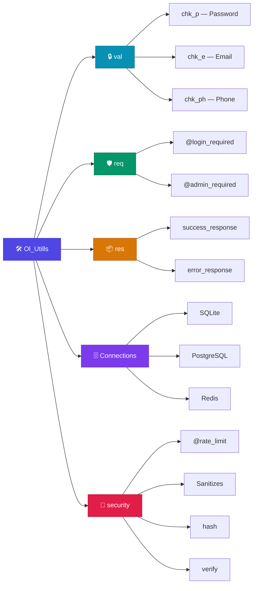
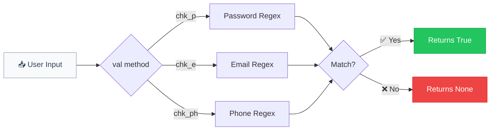
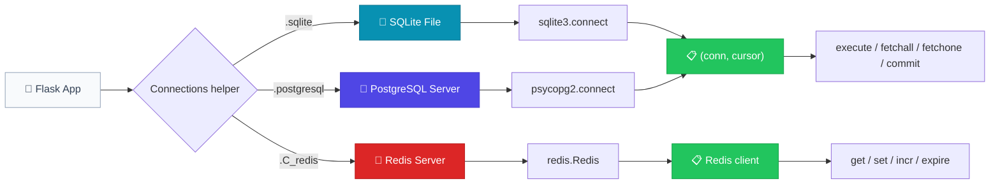
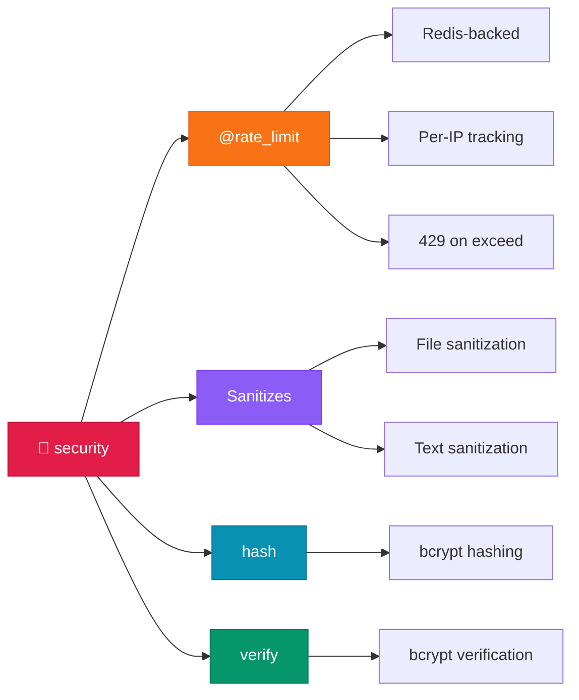

<p align="center">
  
  <h1 align="center">🛠️ Ol_Utills</h1>
  <p align="center">
    A lightweight Flask utility library for validation, authentication, security, and database helpers.
  </p>
</p>

<p align="center">
  <a href="https://pypi.org/project/ol-utills/">
    
  </a>
  <a href="https://pypi.org/project/ol-utills/">
    
  </a>
  <a href="https://github.com/OverLimit-OL/Ol_Utills/blob/main/LICENSE">
    
  </a>
</p>

---

## ✨ Features

- **Input Validation** — Password, email, and phone number validation using battle-tested regex patterns.
- **Auth Decorators** — Drop-in `@login_required` and `@admin_required` decorators for Flask routes.
- **Response Helpers** — Standardized `success_response` and `error_response` for consistent API output.
- **Security** — Rate limiting (Redis-backed), input/file sanitization, bcrypt password hashing & verification.
- **Database Helpers** — Quick-connect utilities for **SQLite**, **PostgreSQL**, and **Redis**.
- **Zero Config** — Works out of the box with any Flask app.

### 🏗️ Architecture Overview



---

## 📦 Installation

```bash
pip install ol-utills flask
```

### Requirements

| Dependency | Purpose                             |
| ---------- | ----------------------------------- |
| `flask`    | Session management & JSON responses |
| `psycopg2` | PostgreSQL connectivity            |
| `redis`    | Redis connectivity & rate limiting  |
| `bcrypt`   | Secure password hashing             |

> **Note:** `sqlite3` and `re` are part of the Python standard library and do not need to be installed.

### Supported Python Versions

- Python **3.8** and above

---

## 🚀 Quick Start

```python
from Ol_Utills import val, req, res, Connections, security

# Validate an email
if val.chk_e("user@example.com"):
    print("Valid email!")

# Connect to a SQLite database
conn, db = Connections.sqlite("app.db")
db.execute("SELECT * FROM users")

# Hash a password
hashed = security.hash("MySecureP@ss1")
print(security.verify("MySecureP@ss1", hashed))  # True
```

---

## 📖 Detailed Documentation

### Table of Contents

1. [val — Validation](#val--validation)
2. [req — Authentication Decorators](#req--authentication-decorators)
3. [res — Response Helpers](#res--response-helpers)
4. [Connections — Database Connections](#connections--database-connections)
5. [security — Security Utilities](#security--security-utilities)
6. [Full Flask App Example](#-full-flask-app-example)

---

### `val` — Validation

The `val` class provides static methods for validating common user inputs using regular expressions. All methods return `True` on success and `None` on failure, making them easy to use in conditional checks.



---

#### `val.chk_p(password)`

Validates password strength against a robust regex pattern.

|               | Details                                              |
| ------------- | ---------------------------------------------------- |
| **Parameter** | `password` _(str)_ — The password string to validate |
| **Returns**   | `True` if valid, `None` if invalid                   |

**Password Rules:**

The password must satisfy **all** of the following criteria:

- ✅ Minimum **7 characters** long (6 + 1 trailing non-whitespace)
- ✅ At least **1 uppercase** letter (`A-Z`)
- ✅ At least **1 lowercase** letter (`a-z`)
- ✅ At least **1 digit** (`0-9`)
- ✅ Must **not** contain whitespace
- ✅ The last character must be a **non-whitespace** character

> **Note:** Special characters (e.g. `@`, `#`, `!`) are allowed but not required.

**Examples:**

```python
from Ol_Utills import val

# ✅ Valid passwords
val.chk_p("MyP@ss1234")    # True — uppercase, lowercase, digit, special char
val.chk_p("Hello1x")        # True — meets all minimum criteria
val.chk_p("Abcdef1")        # True — exactly 7 chars, has upper, lower, digit

# ❌ Invalid passwords
val.chk_p("weak")            # None — too short, no uppercase, no digit
val.chk_p("alllowercase1")  # None — no uppercase letter
val.chk_p("ALLUPPERCASE1")  # None — no lowercase letter
val.chk_p("NoDigits!")       # None — no digit
val.chk_p("Ab1")             # None — too short
```

**Usage in a Flask route:**

```python
from flask import Flask, request, jsonify
from Ol_Utills import val

app = Flask(__name__)

@app.route('/register', methods=['POST'])
def register():
    password = request.form.get('password')

    if not val.chk_p(password):
        return jsonify({
            "error": "Password must be 7+ chars with at least 1 uppercase, 1 lowercase, and 1 digit."
        }), 400

    # Proceed with registration...
    return jsonify({"message": "Registration successful"}), 201
```

---

#### `val.chk_e(email)`

Validates an email address against the **RFC 2822** specification using a comprehensive regex pattern.

|               | Details                                                |
| ------------- | ------------------------------------------------------ |
| **Parameter** | `email` _(str)_ — The email address string to validate |
| **Returns**   | `True` if valid, `None` if invalid                     |

**Validation Covers:**

- ✅ Standard emails: `user@example.com`
- ✅ Subdomains: `user@mail.example.com`
- ✅ Plus addressing: `user+tag@example.com`
- ✅ Dots in local part: `first.last@example.com`
- ✅ Quoted strings: `"unusual@chars"@example.com`
- ❌ Missing `@` symbol
- ❌ Missing domain
- ❌ Spaces in unquoted local parts
- ❌ Control characters

**Examples:**

```python
from Ol_Utills import val

# ✅ Valid emails
val.chk_e("user@example.com")          # True
val.chk_e("first.last@company.co.uk")  # True
val.chk_e("user+filter@gmail.com")     # True
val.chk_e("admin@192.168.1.1")         # True

# ❌ Invalid emails
val.chk_e("not-an-email")              # None — no @ symbol
val.chk_e("@missing-local.com")        # None — no local part
val.chk_e("spaces in@email.com")       # None — spaces not allowed
val.chk_e("")                           # None — empty string
```

---

#### `val.chk_ph(phone)`

Validates international phone numbers.

|               | Details                                               |
| ------------- | ----------------------------------------------------- |
| **Parameter** | `phone` _(str)_ — The phone number string to validate |
| **Returns**   | `True` if valid, `None` if invalid                    |

**Supported Formats:**

- ✅ International: `+1-555-555-5555`
- ✅ With parentheses: `(555) 555-5555`
- ✅ With dots: `555.555.5555`
- ✅ With spaces: `+44 20 7946 0958`
- ✅ Plain digits: `5555555555`

**Examples:**

```python
from Ol_Utills import val

val.chk_ph("+1-800-555-0199")    # True
val.chk_ph("(555) 123-4567")     # True
val.chk_ph("+44 20 7946 0958")   # True
```

---

### `req` — Authentication Decorators

The `req` class provides Flask route decorators for session-based authentication. These decorators wrap your view functions and check the Flask `session` object before allowing access.

**How It Works:**


---

#### `@req.login_required`

Restricts a Flask route to authenticated (logged-in) users only.

|                    | Details                                                   |
| ------------------ | --------------------------------------------------------- |
| **Session Key**    | `session['logged']`                                       |
| **Required Value** | `True` (boolean)                                          |
| **On Success**     | Executes the decorated view function normally             |
| **On Failure**     | Returns `res.error_response('Unauthorized', 401)` |

**Prerequisites:**

You must set `session['logged'] = True` somewhere in your login logic (e.g., after verifying credentials).

**Example:**

```python
from flask import Flask, session, request, jsonify
from Ol_Utills import req

app = Flask(__name__)
app.secret_key = 'your-secret-key'

# Login route — sets session
@app.route('/login', methods=['POST'])
def login():
    username = request.form.get('username')
    password = request.form.get('password')

    # ... verify credentials against database ...

    session['logged'] = True         # ← Required for @login_required
    session['username'] = username   # ← Optional: store user info
    return jsonify({"message": "Logged in successfully"})

# Protected route — requires login
@app.route('/dashboard')
@req.login_required
def dashboard():
    return jsonify({"message": "Welcome to your dashboard"})

# Logout route — clears session
@app.route('/logout')
def logout():
    session.pop('logged', None)
    return jsonify({"message": "Logged out"})
```

**Behavior:**

| Scenario              | `session['logged']` | Result                                   |
| --------------------- | ------------------- | ---------------------------------------- |
| User is logged in     | `True`              | View function runs normally              |
| User is not logged in | Missing or `False`  | Returns `error_response('Unauthorized', 401)` |
| Session expired       | Missing             | Returns `error_response('Unauthorized', 401)` |

---

#### `@req.admin_required`

Restricts a Flask route to admin users only. Works the same as `@login_required` but checks a different session key.

|                    | Details                                                   |
| ------------------ | --------------------------------------------------------- |
| **Session Key**    | `session['admin']`                                        |
| **Required Value** | `True` (boolean)                                          |
| **On Success**     | Executes the decorated view function normally             |
| **On Failure**     | Returns `res.error_response('Unauthorized', 401)` |

**Example:**

```python
# Admin login — sets admin session
@app.route('/admin/login', methods=['POST'])
def admin_login():
    # ... verify admin credentials ...

    session['logged'] = True    # for general auth
    session['admin'] = True     # ← Required for @admin_required
    return jsonify({"message": "Admin logged in"})

# Admin-only route
@app.route('/admin/users')
@req.admin_required
def manage_users():
    return jsonify({"users": ["user1", "user2", "user3"]})
```

**Stacking Decorators:**

You can combine both decorators for routes that require login **and** admin access:

```python
@app.route('/admin/settings')
@req.login_required
@req.admin_required
def admin_settings():
    return jsonify({"settings": "..."})
```

> **Tip:** When stacking, `@req.login_required` should be the outermost decorator (listed first) so the login check runs before the admin check.

---

### `res` — Response Helpers

The `res` class provides utilities for building standardized JSON API responses, ensuring a consistent format across all your endpoints.

---

#### `res.success_response(data)`

Returns a standardized success JSON response with HTTP status `200`.

|               | Details                                             |
| ------------- | --------------------------------------------------- |
| **Parameter** | `data` _(any)_ — The data payload to include        |
| **Returns**   | `(jsonify({'data': data}), 200)` — Flask response tuple |

**Example:**

```python
from Ol_Utills import res

# In a Flask route
@app.route('/users')
def get_users():
    users = [{"id": 1, "name": "Alice"}, {"id": 2, "name": "Bob"}]
    return res.success_response(users)
    # Response: {"data": [{"id": 1, "name": "Alice"}, {"id": 2, "name": "Bob"}]}, 200
```

---

#### `res.error_response(message, code)`

Returns a standardized error JSON response with a custom HTTP status code.

|               | Details                                                    |
| ------------- | ---------------------------------------------------------- |
| **Parameters** | `message` _(str)_ — Error message to return               |
|               | `code` _(int)_ — HTTP status code (e.g. `400`, `404`, `500`) |
| **Returns**   | `(jsonify({'error': message}), code)` — Flask response tuple |

**Example:**

```python
from Ol_Utills import res

@app.route('/users/<int:user_id>')
def get_user(user_id):
    user = find_user(user_id)
    if not user:
        return res.error_response("User not found", 404)
        # Response: {"error": "User not found"}, 404
    return res.success_response(user)
```

---

### `Connections` — Database Connections

The `Connections` class provides quick-connect helper functions for database setup. Each method opens a connection and returns a **(connection, cursor)** tuple.



> **Important:** `Connections.sqlite()` and `Connections.postgresql()` now return a **(connection, cursor)** tuple instead of just a cursor. Use `conn` for `commit()` / `close()`, and `db` for queries.

---

#### `Connections.sqlite(database)`

Opens a connection to a **SQLite** database file and returns a `(connection, cursor)` tuple.

|               | Details                                                                                                                |
| ------------- | ---------------------------------------------------------------------------------------------------------------------- |
| **Parameter** | `database` _(str)_ — Path to the SQLite database file. If the file doesn't exist, SQLite will create it automatically. |
| **Returns**   | `(sqlite3.Connection, sqlite3.Cursor)` — A tuple of connection and cursor objects                                      |

**Examples:**

```python
from Ol_Utills import Connections

# Connect to (or create) a database
conn, db = Connections.sqlite("app.db")

# Create a table
db.execute("""
    CREATE TABLE IF NOT EXISTS users (
        id INTEGER PRIMARY KEY AUTOINCREMENT,
        username TEXT NOT NULL UNIQUE,
        email TEXT NOT NULL,
        created_at TIMESTAMP DEFAULT CURRENT_TIMESTAMP
    )
""")
conn.commit()  # Use conn for commit

# Insert a record
db.execute(
    "INSERT INTO users (username, email) VALUES (?, ?)",
    ("john_doe", "john@example.com")
)
conn.commit()

# Query records
db.execute("SELECT * FROM users")
users = db.fetchall()
for user in users:
    print(user)

# Close when done
conn.close()
```

---

#### `Connections.postgresql(database, user, password, host)`

Opens a connection to a **PostgreSQL** database and returns a `(connection, cursor)` tuple.

|                    | Details                                                        |
| ------------------ | -------------------------------------------------------------- |
| **Parameters**     |                                                                |
| `database` _(str)_ | Name of the PostgreSQL database                               |
| `user` _(str)_     | Database username                                             |
| `password` _(str)_ | Database password                                             |
| `host` _(str)_     | Database host address (e.g. `"localhost"`, `"db.example.com"`) |
| **Returns**        | `(psycopg2.Connection, psycopg2.Cursor)` — A tuple of connection and cursor objects |
| **Requires**       | `psycopg2` package (`pip install psycopg2-binary`)            |

**Examples:**

```python
from Ol_Utills import Connections

# Connect to PostgreSQL
conn, db = Connections.postgresql(
    database="myapp",
    user="admin",
    password="secure_password",
    host="localhost"
)

# Create a table
db.execute("""
    CREATE TABLE IF NOT EXISTS products (
        id SERIAL PRIMARY KEY,
        name VARCHAR(100) NOT NULL,
        price DECIMAL(10, 2),
        in_stock BOOLEAN DEFAULT TRUE
    )
""")
conn.commit()

# Insert a record
db.execute(
    "INSERT INTO products (name, price) VALUES (%s, %s)",
    ("Widget", 19.99)
)
conn.commit()

# Query records
db.execute("SELECT * FROM products WHERE in_stock = %s", (True,))
products = db.fetchall()
```

> **Important:** PostgreSQL uses `%s` for parameter placeholders, while SQLite uses `?`.

---

#### `Connections.C_redis(host, port, password, socket_timeout)`

Creates a connection to a **Redis** server and returns a Redis client instance.

|                            | Details                                                     |
| -------------------------- | ----------------------------------------------------------- |
| **Parameters**             |                                                             |
| `host` _(str)_             | Redis server host (default: `"localhost"`)                  |
| `port` _(int)_             | Redis server port (default: `6379`)                         |
| `password` _(str or None)_ | Redis password (default: `None`)                            |
| `socket_timeout` _(int)_   | Connection timeout in seconds (default: `5`)                |
| **Returns**                | `redis.Redis` client instance (with `decode_responses=True`) |
| **Requires**               | `redis` package (`pip install redis`)                       |

**Examples:**

```python
from Ol_Utills import Connections

# Connect to Redis with defaults
r = Connections.C_redis()

# Connect with custom settings
r = Connections.C_redis(
    host="redis.example.com",
    port=6380,
    password="my_redis_pass",
    socket_timeout=10
)

# Use the Redis client
r.set("greeting", "hello")
print(r.get("greeting"))  # "hello"

r.incr("counter")
print(r.get("counter"))   # "1"
```

---

### `security` — Security Utilities

The `security` class provides essential security tools: Redis-backed rate limiting, input/file sanitization, and bcrypt password hashing with verification.



---

#### `@security.rate_limit(max_requests, window_seconds, r)`

A decorator that adds Redis-backed rate limiting to Flask routes. Tracks requests per client IP address.

|                               | Details                                                              |
| ----------------------------- | -------------------------------------------------------------------- |
| **Parameters**                |                                                                      |
| `max_requests` _(int)_        | Maximum allowed requests per window (default: `20`)                  |
| `window_seconds` _(int)_      | Time window in seconds (default: `60`)                               |
| `r` _(Redis client or None)_ | Optional Redis client; auto-connects via `Connections.C_redis()` if `None` |
| **On Limit Exceeded**         | Returns `429 Too Many Requests` JSON response                       |
| **Requires**                  | A running Redis server                                               |

**Example:**

```python
from flask import Flask
from Ol_Utills import security, Connections

app = Flask(__name__)

# Using default settings (20 requests per 60 seconds, auto Redis connection)
@app.route('/api/data')
@security.rate_limit()
def get_data():
    return {"data": "some data"}

# Custom limits with explicit Redis connection
r = Connections.C_redis(host="redis.example.com")

@app.route('/api/sensitive')
@security.rate_limit(max_requests=5, window_seconds=30, r=r)
def sensitive_endpoint():
    return {"data": "sensitive data"}
```

**How It Works:**

| Step | Action |
| ---- | ------ |
| 1    | Client IP is extracted from the request |
| 2    | A Redis counter for that IP is incremented |
| 3    | On first request, a TTL (time-to-live) is set on the key |
| 4    | If the counter exceeds `max_requests`, a `429` response is returned |
| 5    | After the window expires, the counter resets automatically |

> **Note:** If Redis is unavailable, the decorator gracefully falls through and allows the request.

---

#### `security.Sanitizes(type, file, text)`

Strips HTML tags from files or text input to prevent XSS and injection attacks.

|               | Details                                                                   |
| ------------- | ------------------------------------------------------------------------- |
| **Parameters** |                                                                          |
| `type` _(str)_ | `"file"` to sanitize a file, or any other value for text sanitization    |
| `file` _(str or None)_ | File path to sanitize (required when `type="file"`)             |
| `text` _(str)_ | Text input to sanitize (default: `"text"`)                              |
| **Returns**   | File path _(str)_ if file mode, sanitized text _(str)_ if text mode      |

**Examples:**

```python
from Ol_Utills import security

# Sanitize text input
clean = security.Sanitizes('text', text='Hello <script>alert("xss")</script> World')
print(clean)  # "Hello alert("xss") World"

# Sanitize a file in-place
security.Sanitizes('file', file='user_upload.csv')
# Removes all HTML tags from the file content and rewrites it
```

---

#### `security.hash(password)`

Hashes a password using **bcrypt** with an auto-generated salt.

|               | Details                                              |
| ------------- | ---------------------------------------------------- |
| **Parameter** | `password` _(str)_ — The plaintext password to hash  |
| **Returns**   | `bytes` — The bcrypt hashed password                 |
| **Requires**  | `bcrypt` package (`pip install bcrypt`)               |

**Example:**

```python
from Ol_Utills import security

hashed = security.hash("MySecureP@ss1")
print(hashed)  # b'$2b$12$...'

# Store `hashed` in your database
```

---

#### `security.verify(password, hashed)`

Verifies a plaintext password against a bcrypt hash.

|               | Details                                                     |
| ------------- | ----------------------------------------------------------- |
| **Parameters** | `password` _(str)_ — The plaintext password to check       |
|               | `hashed` _(bytes)_ — The bcrypt hash to compare against     |
| **Returns**   | `True` if the password matches, `False` otherwise            |
| **Requires**  | `bcrypt` package (`pip install bcrypt`)                      |

**Example:**

```python
from Ol_Utills import security

hashed = security.hash("MySecureP@ss1")

# ✅ Correct password
security.verify("MySecureP@ss1", hashed)    # True

# ❌ Wrong password
security.verify("WrongPassword1", hashed)   # False
```

**Full Registration/Login Flow:**

```python
from flask import Flask, request, jsonify
from Ol_Utills import security, Connections, val

app = Flask(__name__)
conn, db = Connections.sqlite("app.db")

@app.route('/register', methods=['POST'])
def register():
    password = request.form.get('password')

    if not val.chk_p(password):
        return jsonify({"error": "Weak password"}), 400

    hashed = security.hash(password)
    db.execute("INSERT INTO users (password) VALUES (?)", (hashed,))
    conn.commit()
    return jsonify({"message": "Registered"}), 201

@app.route('/login', methods=['POST'])
def login():
    password = request.form.get('password')
    db.execute("SELECT password FROM users WHERE id = 1")
    stored_hash = db.fetchone()[0]

    if security.verify(password, stored_hash):
        return jsonify({"message": "Login successful"})
    return jsonify({"error": "Invalid credentials"}), 401
```

---

## 🔧 Full Flask App Example

A complete example showing all library features working together:


```python
from flask import Flask, session, request, jsonify
from Ol_Utills import val, req, res, Connections, security

app = Flask(__name__)
app.secret_key = 'your-secret-key-here'

# Initialize database
conn, db = Connections.sqlite("app.db")
db.execute("""
    CREATE TABLE IF NOT EXISTS users (
        id INTEGER PRIMARY KEY AUTOINCREMENT,
        username TEXT UNIQUE,
        email TEXT,
        password BLOB,
        is_admin BOOLEAN DEFAULT 0
    )
""")
conn.commit()


@app.route('/register', methods=['POST'])
def register():
    email = request.form.get('email')
    password = request.form.get('password')
    username = request.form.get('username')

    # Validate email
    if not val.chk_e(email):
        return res.error_response("Invalid email format", 400)

    # Validate password strength
    if not val.chk_p(password):
        return res.error_response(
            "Password must be 7+ chars with uppercase, lowercase, and a digit", 400
        )

    # Hash password before storing
    hashed = security.hash(password)

    # Insert user into database
    try:
        db.execute(
            "INSERT INTO users (username, email, password) VALUES (?, ?, ?)",
            (username, email, hashed)
        )
        conn.commit()
    except Exception as e:
        return res.error_response(str(e), 500)

    return res.success_response({"message": "User registered successfully"})


@app.route('/login', methods=['POST'])
@security.rate_limit(max_requests=10, window_seconds=60)
def login():
    username = request.form.get('username')
    password = request.form.get('password')

    db.execute("SELECT * FROM users WHERE username = ?", (username,))
    user = db.fetchone()

    if user and security.verify(password, user[3]):
        session['logged'] = True
        session['username'] = username
        if user[4]:  # is_admin column
            session['admin'] = True
        return res.success_response({"message": "Login successful"})

    return res.error_response("Invalid credentials", 401)


@app.route('/dashboard')
@req.login_required
def dashboard():
    return res.success_response({
        "message": f"Welcome, {session.get('username')}!",
        "role": "admin" if session.get('admin') else "user"
    })


@app.route('/admin/panel')
@req.admin_required
def admin_panel():
    db.execute("SELECT id, username, email FROM users")
    users = db.fetchall()
    return res.success_response({"users": users})


@app.route('/logout')
def logout():
    session.clear()
    return res.success_response({"message": "Logged out"})


if __name__ == '__main__':
    app.run(debug=True)
```

---

## 🧪 Running Tests

```bash
cd tests
python test.py
```

---

## 🤝 Contributing

Contributions are welcome! Here's how to get started:

1. **Fork** the repository
2. **Create** your feature branch (`git checkout -b feature/amazing-feature`)
3. **Commit** your changes (`git commit -m 'Add amazing feature'`)
4. **Push** to the branch (`git push origin feature/amazing-feature`)
5. **Open** a Pull Request

---

## 📄 License

Distributed under the **MIT License**. See [`LICENSE`](LICENSE) for more information.

---

<p align="center">
  Made with ❤️ by <a href="https://github.com/OverLimit-OL">OverLimit (OL)</a>
</p>
